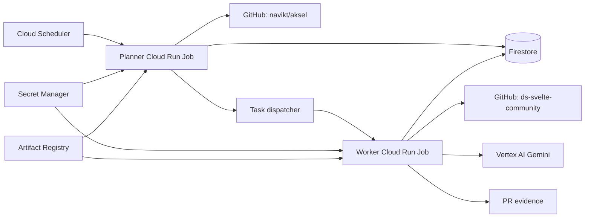
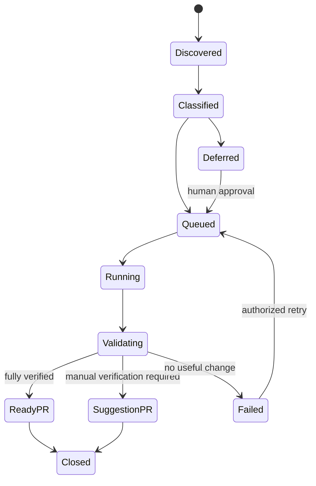

# Architecture

## Overview

The system consists of a small control plane and disposable execution workers.
Persistent decisions and task state live outside the worker filesystem.



## Components

### Planner

Runs daily and performs deterministic work:

1. Read `ai-maintainer.toml` target policy from the target repository's default
   branch and inject separately trusted platform configuration.
2. Read the last processed Aksel version from Firestore.
3. Fetch newer non-draft Aksel releases in ascending order.
4. Read package changelogs and changed paths for each release.
5. Produce component-scoped candidate tasks.
6. Apply policy filters and priorities.
7. Enqueue tasks without exceeding the active PR or budget limits.

The planner must not edit code or call a coding model.

### Classifier

Combines deterministic rules with model-assisted classification.

Deterministic inputs include:

- changed upstream paths;
- changelog component prefixes;
- current parity-manifest status;
- configured complex-change signals;
- whether the component exists locally;
- whether relevant browser tests exist;
- release type and deprecation metadata.

The classifier produces:

- affected components;
- risk level;
- evidence requirements;
- implementation or investigation mode;
- recommended PR grouping;
- initial cost estimate.

### Worker

Each worker processes one task in an isolated execution:

1. Obtain a Firestore lease.
2. Create a GitHub App installation token.
3. Clone the target repository into ephemeral storage.
4. Create or restore the task's deterministic branch.
5. Fetch the exact upstream tag and relevant files.
6. Assemble bounded model context.
7. Ask the configured model to investigate and implement.
8. Enforce changed-path and diff-size limits.
9. Run validation.
10. Generate evidence and a concise test plan.
11. Push and create or update the PR.
12. Record token usage, outcome, and provenance.

The model should not receive the GitHub App private key or direct access to Secret
Manager. Git and GitHub operations are performed by trusted worker code.

### Evidence generator

For UI changes, generate:

- Svelte screenshot;
- React screenshot using the same story and theme;
- pixel diff when mismatched;
- machine-readable test results;
- summary of HTML differences when present.

Evidence should be uploaded to GitHub user attachments where possible. Cloud Storage
may be used as a temporary staging area, but permanent PR evidence should not depend
on short-lived signed URLs.

### GitHub integration

The GitHub App needs:

- repository contents: read and write;
- pull requests: read and write;
- issues: read and write;
- checks/actions metadata: read;
- metadata: read.

It must not have:

- administration;
- environments;
- deployments;
- package publishing;
- release creation;
- merge bypass.

## Persistent data

Firestore is sufficient for the initial system.

### Release record

```text
repository
upstream_version
published_at
discovered_at
status
candidate_task_ids[]
source_commit
```

### Task record

```text
task_id
idempotency_key
target_repository
base_commit
upstream_from
upstream_to
component_keys[]
risk
mode
status
branch
pull_request_number
attempt_count
lease_owner
lease_expires_at
estimated_cost_usd
actual_cost_usd
model_calls[]
validation_results[]
created_at
updated_at
```

### Budget record

```text
month
configured_limit_usd
reserved_usd
actual_usd
task_ids[]
```

## Task states



`ReadyPR` means the configured automated evidence passed. It does not mean approved
or merged. `SuggestionPR` is always a draft.

## Idempotency

Use a stable key based on:

```text
target repository
upstream version
sorted component keys
task mode
policy revision
```

Before creating work, check:

- Firestore task records;
- existing branch name;
- open and closed PR metadata;
- an embedded idempotency marker in the PR body.

Retries update the existing task and branch. They must not create another PR.

## Isolation and limits

Each task receives:

- a clean checkout;
- one component or approved component family;
- an allowed-path set;
- maximum changed files and diff lines;
- maximum model calls;
- maximum input and output tokens;
- maximum execution time;
- a reserved budget amount.

Unexpected changed paths fail the task before push unless explicitly allowed by policy.

## Suggested worker repository structure

```text
ai-maintainer/
|-- src/
|   |-- cli/
|   |-- config/
|   |-- planner/
|   |-- upstream/aksel/
|   |-- classifier/
|   |-- executor/
|   |-- models/vertex/
|   |-- validation/
|   |-- evidence/
|   |-- github/
|   |-- state/firestore/
|   |-- budget/
|   `-- observability/
|-- test/
|   |-- fixtures/
|   |-- integration/
|   `-- contract/
|-- deploy/
|   |-- terraform/
|   `-- Dockerfile
|-- schemas/
|-- package.json
|-- bun.lock
`-- README.md
```

Keep provider-specific integrations behind interfaces so model and state backends can
be changed without rewriting task orchestration.
